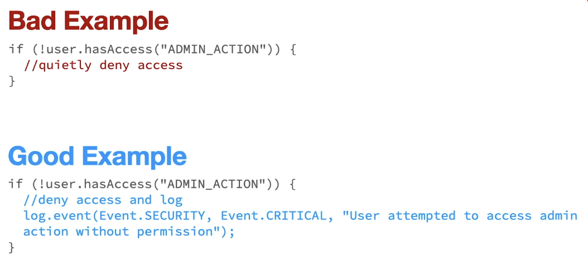
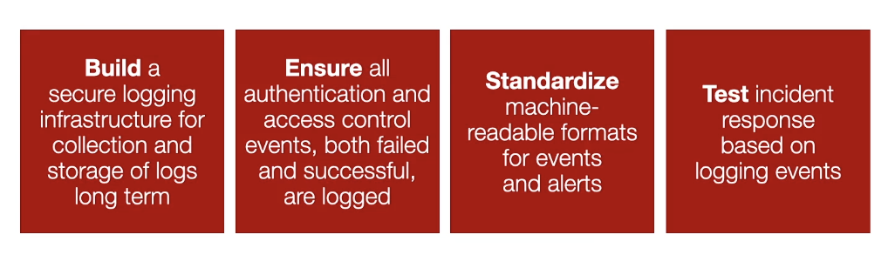

## Security Logging And Monitoring Failures (A9)

Having auditable events, warnings and errors within our web application or API, which are not adequately logged.

To have adequate logging, developers and security staff must work together.

Agree on a security centric logging standard:

- Developers know exactly what needs to be logged.
- Security teams need to monitor logs for suspicious activity.

A proper logging infrastructure is necessary to securely collect and store logs:

- Having adequate logging infrastructure is a prerequesite in order to be able to analyze the logs.

### Key Concepts:

#### KC1 - Event Logging

- Provides a standard centralized way of recording important software events.
- Records events from various sources and stores them, typically, in a single collection, called an event log.

#### KC2: Event Monitoring

- The process of collecting, analyzing and signaling event occurrences.
- The process of collecting events in our event log.
- Collected for future analysis.

#### KC3: Security Logging and Monitoring

- This is the process of logging and monitoring events that can impact the confidentiality, integrity or availability of our software.
- Not a specific risk, leanding to compromised software.

Helps us with:

- Deal with security incidents.
- With forensics.
- Solve a previous attack.
- Protect our application from future attacks.

---

### Examples:

### Why Are Security Logging And Monitoring Failures Common?

Developers are unaware of the security events that they need to log.

- Appropriate alerting thresholds and response escalation processes are not in place... or effective.
- Leads to applications that cannot detect, escalate, or alert for attacks or suspicious activity

Incident response/security operations teams do not know enough about how the application is working and what should be logged.

- We forget how suspicious activities need to be logged.
- We need to think of what actions are important.
- This requires further analysis and time to develop best logging and reporting for suspicious activies or attacks.

### Best Protection Strategies

- B: Build a secure logging infrastructure for collection and storage of logs long term.
- E: Ensure all authentication and access control events, both failed and successful, are logged.
- S: Standardize machine-readable formats for eveents and alerts.
- T: Test indicent response based on logging events.
