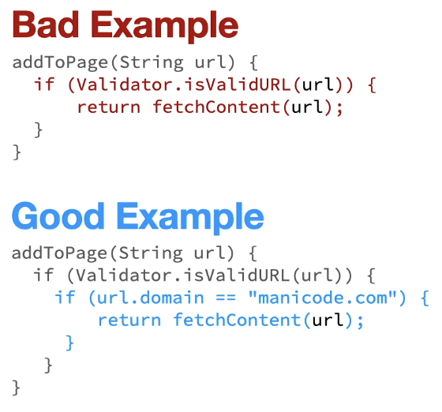
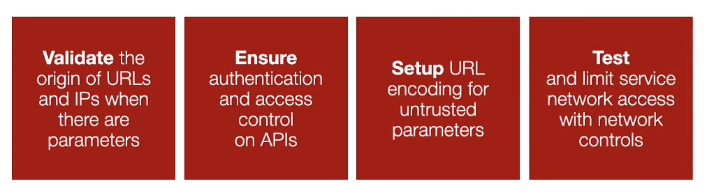

## Server Side Request Forgery (A10)

Forcing a server to make a request to an unexpected resource.

Effects that A10 can lead:

- Can lead to a variety of impacts involving loss of data, privilege escalation and more.
- Server-side request forgery is a common vulnerability in the world of microservices or multi-tiered web services - often referred to as N-tiered webservices.

### Key Concepts:

#### KC1 - Server Side

- Programs and operations that run on the server, like an API on the backend.
- Contrast to processes that run on the client, like a browser or mobile app.

#### KC2 - Request Forgery

- Crafting a web request that appears legitimate but contains malicious input.
- Request Forgery is sending a data request that contains malicious data within it.

#### KC3 - Cross-Site Request Forgery (CSRF)

An attack that forces the user to execute unwanted actions while authenticated to your web application.

#### KC4 - One-Click Attack

- Sending a malicious URL to an authenticated user that performs an action they do not approve or know about.
- One click attacks are a specific type of Cross-Site Request Forgery.

---

### Examples:

### Why is Server Side Request Forgery Common?

**Traditional code and dynamic scanning tools struggle o accurately identify Server-Side Request Forgery.**

As modern web applications, provide end-users with convenient features, fetching a URL becomes a common scenario

Passing URL and IP addresses is very common for logging purposes.

- Typical cloud metadata storage over HTTP on a specific URL (`http://169.254.169.254/`).
- "Internal" services such as a service listening on localhost only (`http://localhost:28017/`).

### Best Protection Strategies

- V: Validate the origin of URLs and IPs when there are parameters.
- E: Ensure authentication and access control on APIs.
- S: Setup URL encoding for untrusted parameters.
- T: Test and limit service network access with network controls.
