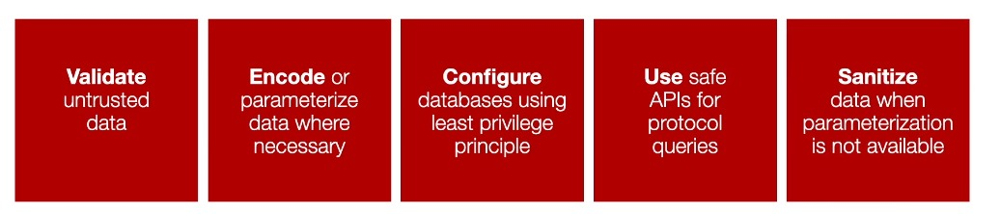

## Injection (A3)

An instance where an attacker can supply untrusted data to a web application that is processed by the protocol as a command or query

**Key Concept 1: Protocol and Protocol Encapsulation:**

- **Protocol**: a set of rules for exchanging information
- **Protocol Encapsulation**: when one set of rules is wrapped into another

**Example**:
SQL Injection: usually, SQL commands are encapsulated within HTTP requests, if
not handled, it can lead to SQL Injection.

HTTP Request:

```
POST /login HTTP/1.1
Host: example.com
Content-Type: application/x-www-form-urlencoded

username=admin&password=password123
```

SQL Query:

```
SELECT * FROM users WHERE username = 'admin' AND password = 'password123';
```

HTTP Request with SQL Injection:

```
POST /login HTTP/1.1
Host: example.com
Content-Type: application/x-www-form-urlencoded

username=admin&password=password123' AND 1=1; drop database example_db;
```

**Key Concept 2: New Malicious Commands:**

New malicious commands are added to an application, hence the term "injection".

### Definition: A3 Injection

An instance where an attacker can supply untrusted data to a web application that is processed by the protocol as a command or query.

**Injection changes the execution flow typically leading to:**

- Changes ot the execution flow of your web app or API
- Stealing of data from databases and other resources
- Running of malicious operating system commands
- Various bypasses in authentication and/or access control

**Depending on the protocol, there are many forms of injection** most common are:

- SQL and LDAP Injection
- Operating System Injection also known as Command Injection
- Object Query Injection agains queries on objects

### Examples

**Bad Example**:

```
SqlCommand objCommand = new SqlCommand(
    "SELECT id, name FROM user_table WHERE
    username = ' " & Request("NameTextBox.Text") & " ' AND
    password = ' " & Request("PasswordTextBox.Text") &
    " ' ");
```

**Good Example**:

```
SqlCommand objCommand = new SqlCommand(
    "SELECT id, name FROM user_table WHERE
    Name = @Name AND Password = @Password", objConnection;
  objCommand.Parameters.Add("@Name", NameTextBox.Text);
  objCommand.Parameters.Add("@Password", PasswordTextBox.Text);
```

### Why Are Injection Commmon?

Building web applications involves many layers and protocols:

- It is hard to get protocols to talk to one another correctly
- Limits what data gets passed, seen as an extra step
- The primary reason is: insufficient user input validation
- Data that the user controls is not validated for correctness

### How to Stop Injection Attacks:



- V: Validate untrusted data
- E: Encode data where necessary
- C: Configure databases using **Least Privilege Principle**
- U: Use safe APIs for protocol queries
- S: Sanatize data when parameterization is not available

#### Least Privilege Principle:

The least privilege principle is a security protocol that dictates that users, applications, and systems should have the minimum level of access — or permissions — necessary to perform their tasks.

This minimizes the potential damage from accidental or malicious actions by limiting access to only what is essential. When configuring databases, applying the least privilege principle ensures that only authorized users and applications have the necessary permissions to access, modify, or manage the database, reducing the risk of unauthorized access and potential data breaches.

---

### Glossary:

| Word   | Description                                                                                         |
| ------ | --------------------------------------------------------------------------------------------------- |
| Bypass | A technique used to circumvent or avoid security measures.                                          |
| LDAP   | A protocol for accessing and maintaining distributed directory information services over a network. |
