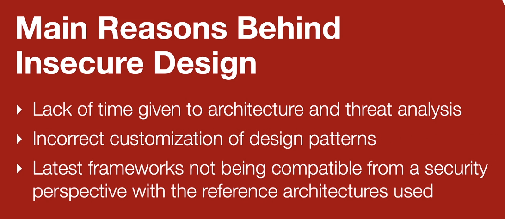
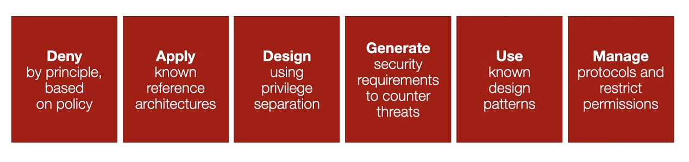

## Insecure Design (A4)

The collection of security flaws within the web application that cannot be attributed to or fixed by impleentation.

### Key Concepts:

#### KC1 - Archtectural Flaws

There are three main categories of architectural flaws:

- **Flaws of Omission**: ignoring a threat or security requirement
- **Flaws of Commission**: bad design, for example: client-side authentication
- **Flaws of Realization**: design is good, but errors exist in implementation

#### KC2 - Secure Design Patterns

Using patterns in code that eliminate vulnerabilities is crucial.

Example: the pattern of privilege separation which limits the amount of code running with elevated privileges.

#### KC3 - Reference Architectures

Template solutions to combine the software you are using.

---

### Examples:

**Bad Example**:

```
userAccess() {
    if (user.isAuthorized("USER)) {
        // authorize user independent of zone
    }
}
```

**Good Example**:

```
userAccess() {
    if (user.isConnectingFromZone(ZONE.SemiTrusted)) {
        // authorize user based on zone
    }
}
```

### Why is Insecure Design Common?

- Not enough time is given to architecture and design
- Secure design patterns are incorrectly customized
- Reference architectures are not updated for latest frameworks



### Best Protection Strategies



- D: Deny by principle based on policy
- A: Apply know reference architectures
- D: Design using privilege separation
- G: Generate security requirements to counter threats
- U: Use known design patterns
- M: Manage protocols and restrict permissions
