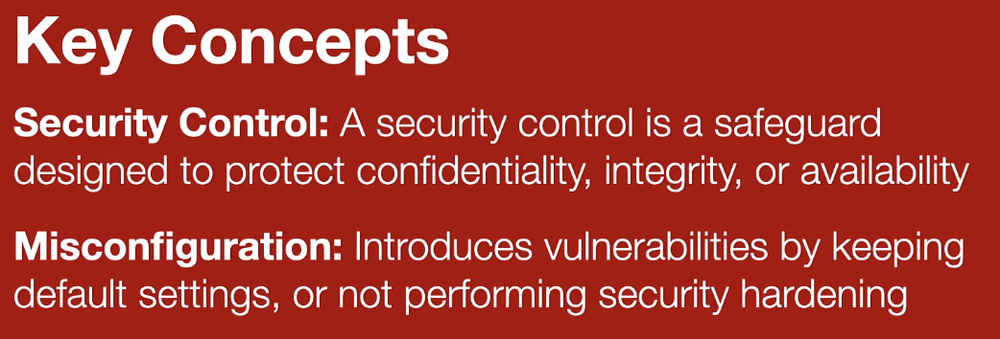
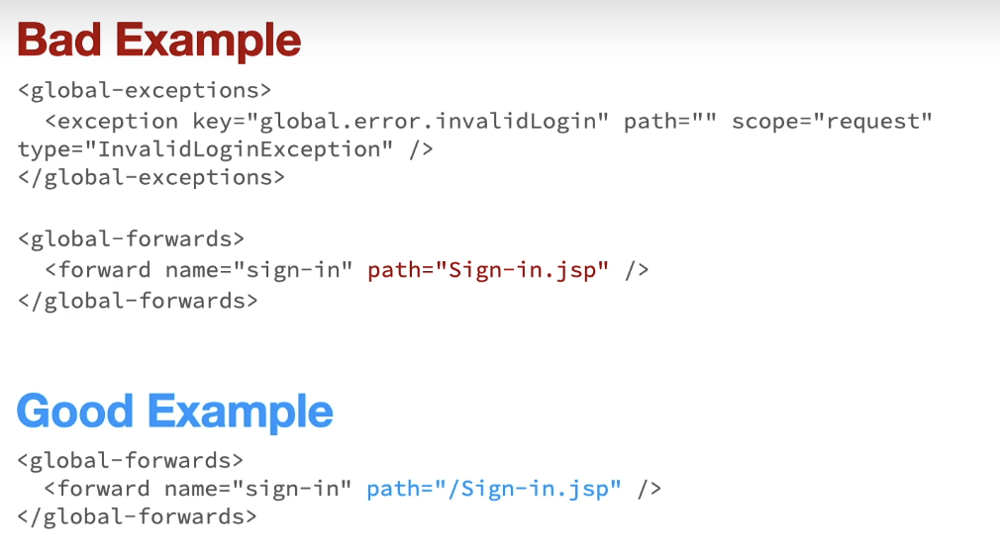
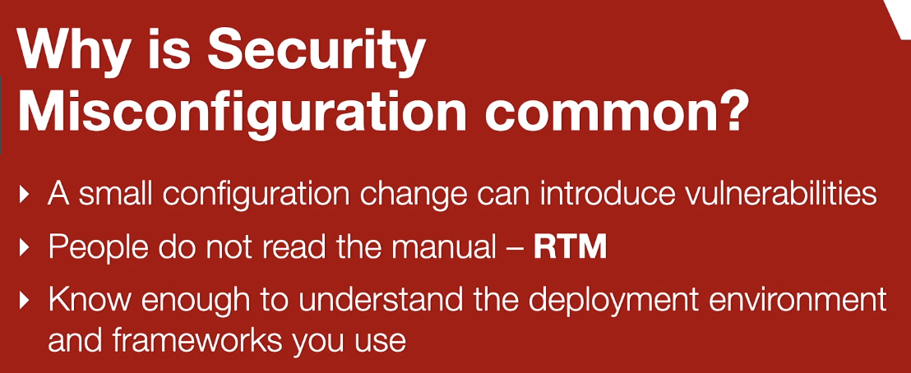
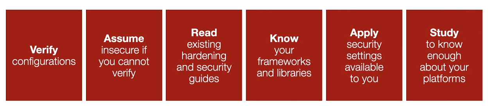

## Security Misconfiguration (A5)

Failing to implement the necessary controls to secure the configurations of your application.

**Examples**:

- Application is missing the necessary security hardening
- Default accounts are still active
- Unnecessary features are installed and enabled

**A5 is a Broad Category**:

- Many different types of misconfigurations
- Lead to many different type of vulnerabilities

### Key Concepts:

#### KC1 - Security Control

- An information system safeguard or countermeasure
- Design to protect:
- - Confidentiality
- - Integrity
- - Availability

#### KC2 - Misconfiguration

- Introduce security vulnerabilities
- Occurs because the configuration has not been hardened
- Result of keeping a default setting

---

### Examples:

### Why is Security Misconfiguration Common?

- A small configuration change can introduce vulnerabilities
- People do not read the manual - RTM
- Know enough to understand the deployment environment and frameworks you use

### Best Protection Strategies

- V: Verify configurations
- A: Assume insecure if you cannot verify
- R: Read existing hardening and security guides
- K: Know your frameworks and libraries
- A: Apply security settings available to you
- S: Study to know enough about your platforms
