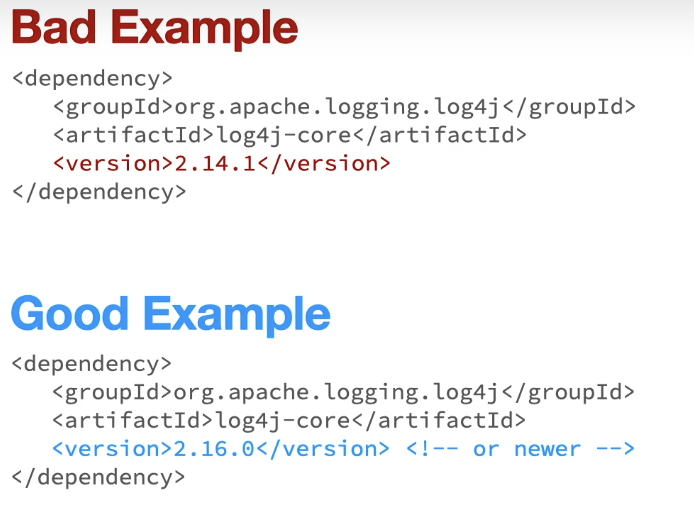

## Vulnerable And Outdated Components (A6)

Having, in use, software components that are vulnerable, unsupported, or out of date.

- Specific vulnerabilities are known, but unable to be patched in time
- Patching is not available for your systems based on specific software dependencies
- The organization does not know what software components and versions they have in use

### Key Concepts:

#### KC1 - Previous Versions of Software Have Vulnerabilities

Usually, these vulnerabilities are fixed in new versions of the software

#### KC2 - End of Life and End of Sale

- **End of Life**: the date software support stops.
- **End of Sale**: the last day you can order a product through a vendor
- **Unsupported Software**: the operating system of 10-year-old computer

#### KC3 - Attackers Attempt to Find and Exploit Vulnerabilities

Out of date software is on top of their list

---

### Examples:

`Log4J v2.14.1` has a vulnerability known as [Log4Shell](https://en.wikipedia.org/wiki/Log4Shell). This was fixed on `v2.16+`

### Why is Vulnerable And Outdated Components Common?

- Not a regular process that coincides with when a specific vulnerability is discovered.
- The process for ensuring 3rd party libraries are updated is complex and time-consuming.
- Updating 3rd party libraries is neglected.

### Best Protection Strategies

- C: Check periodically that your libraries are updated
- O: Only obtain components from official trusted sources
- R: Remove unusued dependencies
- U: Use only features that are necessary
- S: Stay current with latest vulnerabilities
