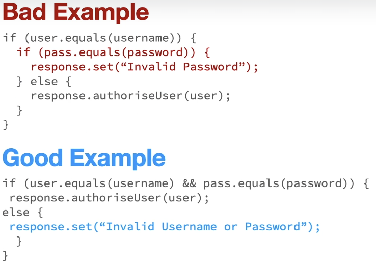
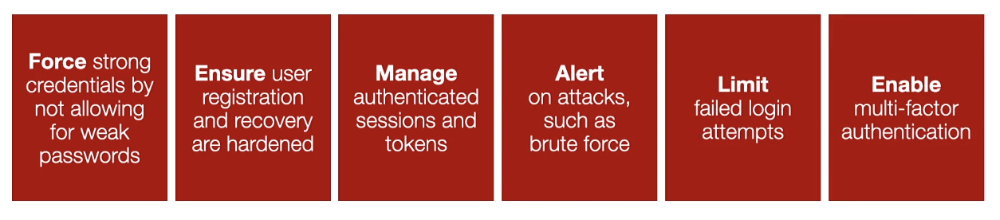

## Authentication and Identification Failures (A7)

Being able to perform successful attacks that disclose identity attributes on the system or web application in use.

A web application is allowing for authentication controls to be either subverted or bypassed.

- Forgot password processes.
- Weak or misconfigured identity attributes:
- - 4-character password, with no complexity;
- - Despite logout, a session remains valid.

### Key Concepts:

#### KC1 - Digitial Identity

- The digital identity is a set of attributes.
- These attributes relate to a person or organization, **examples**: `age`, `bank`, `balance`, `username`, or `password`.

#### KC2 - Identification

The act of showing or sharing attributes relating to your identity.

**Example**: In the airport you must show your passport to identify yourself.

#### KC3 - Authentication

The process of confirming the identify of a user. During this process, the identity presented is being confirmed.

---

### Examples:

;

### Why are Authentication and Identification Failures Common?

The most difficult point to secure for any web application is the **point of interaction with the user**.

You must factor in many attack scenarios and different types of attack techniques. For example:

- **Credential stuffing**: short password list against 1000s of accounts;
- **Brute force attacks**: one account against millions of passwords.

### Best Protection Strategies

- F: Force strong credentials by not allowing for weak passwords;
- E: Ensure user registration and recovery are hardened;
- M: Manage authenticated sessions and tokens;
- A: Alert on attacks, such as brute force;
- L: Limit failed login attempts;
- E: Enable multi-factor authentication.
