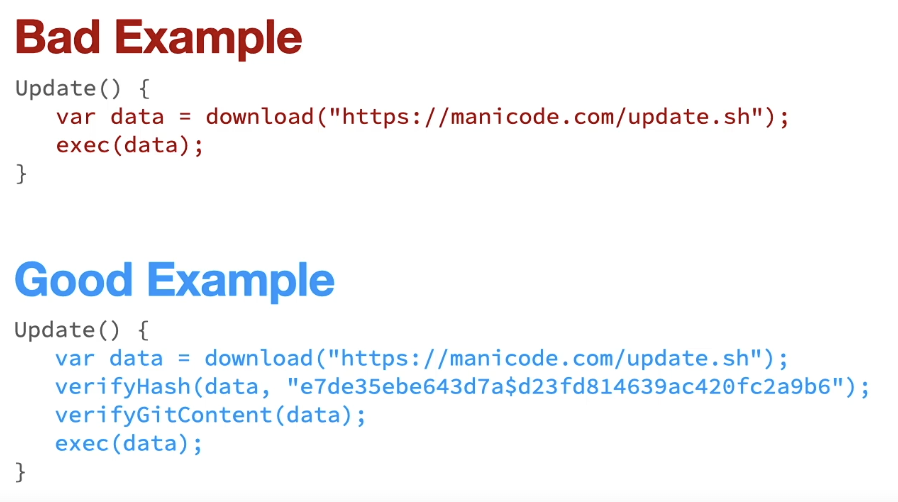
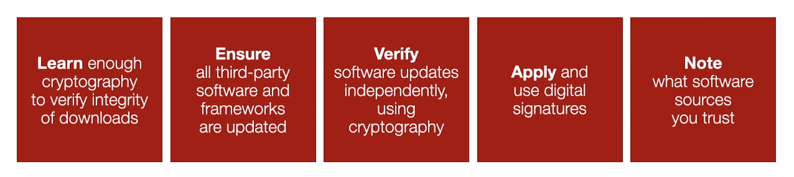

## Software and Integrity Failures (A8)

Having software code that does not prevent the inclusion of functionality from untrusted sources.

This means you need to know, for your software application, what sources of code you trust.

- Think of repositories of libraries you are using.
- Always download the update source code dependencies from software repositories.

There are also cases of parsing data relating to software being loaded during runtime

- Deserializing untrusted data at runtime.
- Know what software code is being pulled in dynamically.
- Dynamic loading of software can also cause Software and Data Integrity Failures.

### Key Concepts:

#### KC1 - Software Integrity Verification

- Based on th principle of trust but verify
- Process of verifying the inclusion or functionality from untrusted software sources

#### KC2 - Continuous Integration

- Automated tasks - typically at the end of each working day.
- Merging of all developers' working copies

#### KC3 - Continuous Delivery

- Process of releasing software in an automated way, without manual intervention.
- Be careful, you could pull in untrusted software libraries into your software.

---

### Examples:

### Why are Software and Integrity Failures Common?

Many software solutions/components auto-update without sufficient integrity checks.

- Attackers know this and try to exploit it.
- Attackers target software update mechanisms.
- As a trend, problems around auto-updates are increasing.

Software integrity problems are hard to detect.

- Your developers are downloading software libraries required for the software they are making.
- Security teams are not involved with those processes, but they should be.

### Best Protection Strategies

- L: Learn enough cryptography to verify integrity of downloads.
- E: Ensure all third-party software and frameworks are updated.
- V: Verify software updates independently, using cryptography.
- A: Apply and use digital signatures.
- N: Note what software sources you trust.
